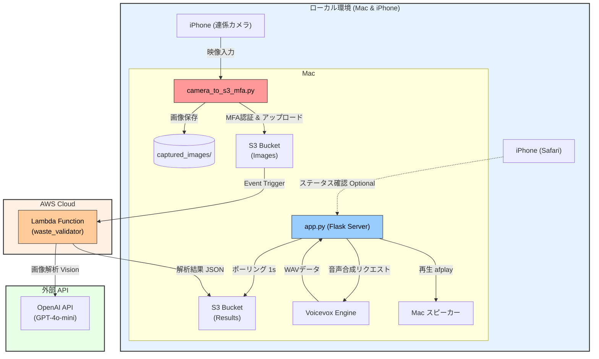

# システム構成図 (System Architecture)

## 処理フロー詳細

1.  **画像取得**: `camera_to_s3_mfa.py` がiPhoneの連係カメラを使用してx秒ごとに写真を撮影。
2.  **アップロード**: 撮影した画像を AWS S3 (`wackathon-2025-trash-images`) にアップロード。
3.  **解析実行**: S3へのアップロードをトリガーに Lambda が起動。OpenAI API で画像を解析。
4.  **結果保存**: Lambda が解析結果（メッセージ、判定など）を JSON ファイルとして S3 (`wackathon-2025-voice-responses/results/`) に保存。
5.  **結果検知**: `app.py` が S3 を監視しており、新しい JSON ファイルを見つけるとダウンロード。
6.  **音声生成**: `app.py` がローカルの Voicevox にテキストを送り、音声データ (WAV) を生成。
7.  **音声再生**: 生成された音声を Mac のスピーカーから再生 (`afplay`)。
