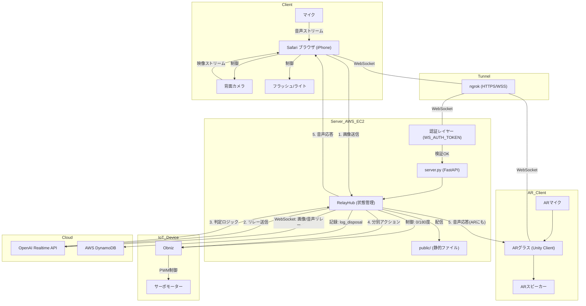

# システム構成図 (System Architecture)

## 概要
iPhoneの**フラッシュ**や**0.5倍ズーム**を活用するため、Webアプリ形式で実装されています。
また、**Obniz** を使用したサーボモーター制御による物理的なゴミ分別と、**ARグラス**への音声ルーティングに対応しています。

## コンポーネント図

## 主要コンポーネント

1.  **フロントエンド (iPhone/Safari)**
    *   **役割**: カメラ映像・音声の取得、ハードウェア制御。
    *   **通信**: ngrok経由でバックエンドとWebSocket通信。

2.  **ARクライアント (Unity)**
    *   **役割**: ユーザーの音声入力とAI音声出力のインターフェース。
    *   **特徴**: 環境変数 `AUDIO_ENDPOINT=ar` の場合、音声のやり取りはこちらが優先されます。

3.  **バックエンド (AWS EC2)**
    *   **ファイル**: `camera/webapp/server.py`
    *   **役割**: 全コンポーネントのハブ。
    *   **RelayHub**: 画像処理、OpenAIとの通信、Obniz制御を一元管理します。
    
4.  **IoT制御 (Obniz)**
    *   **役割**: サーボモーターを物理的に動かしてゴミを振り分けます。
    *   **動作**: OK=0度、NG=180度、待機=90度。

5.  **AIエンジン (OpenAI)**
    *   **サービス**: OpenAI Realtime API
    *   **役割**: 「関西弁の厳しい検査官」として振る舞い、Tool Call (`log_disposal`) を通じてサーバーへ物理動作を指示します。

## データフロー

1.  **画像認識**:
    *   iPhoneが画像を送信 → サーバーが変化検知 → OpenAIへ送信。
2.  **判定プロセス**:
    *   OpenAIが画像を見て判断 → `log_disposal` 関数を呼び出し。
3.  **アクション実行**:
    *   **DB**: 判定結果を記録。
    *   **物理**: 結果に基づいてObniz経由でサーボを回転。
    *   **音声**: 判定理由を関西弁でフィードバック。

## セキュリティ機能

1.  **WebSocket認証**: `WS_AUTH_TOKEN` による厳格なアクセス制御。
2.  **AWS IAM**: 最小権限の原則に基づいたDynamoDBアクセス権限。
3.  **ngrok**: 一時的な公開URLによる通信経路の保護。
