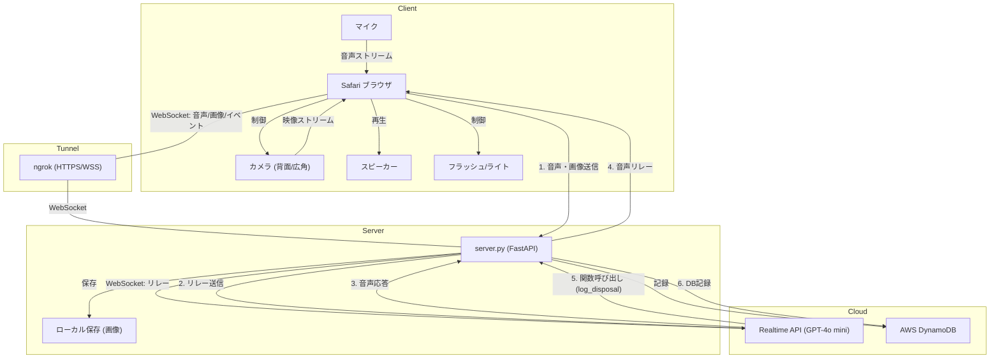

# システム構成図 (System Architecture)

## 概要
iPhoneの**フラッシュ**や**0.5倍ズーム**を活用するため、Webアプリ形式で実装されています。
iPhoneのSafariからアクセスし、Mac上のサーバーを経由してOpenAIのRealtime APIと通信します。

## コンポーネント図

## 主要コンポーネント

1.  **フロントエンド (iPhone/Safari)**
    *   **ファイル**: `index.html`
    *   **役割**: カメラ映像・音声の取得、ハードウェア制御（フラッシュ、ズーム）、ユーザーインターフェース。
    *   **通信**: ngrokが提供するHTTPS経由でバックエンドとWebSocket通信を行います。

2.  **バックエンド (Mac)**
    *   **ファイル**: `server.py`
    *   **役割**: リレーサーバーとして機能。iPhoneからのメディアを受け取り、検証用に画像を保存し、OpenAIへ転送します。また、OpenAIからの応答をiPhoneへ返します。
    *   **フレームワーク**: FastAPI + Uvicorn

3.  **AIエンジン (OpenAI)**
    *   **サービス**: OpenAI Realtime API (Beta)
    *   **役割**: 音声と画像を解析し、音声応答を生成します。「ペットボトル検査官」として、厳しい基準（キャップ・ラベル・異物なし）で判定を行います。

4.  **データベース**
    *   **ファイル**: `camera/database.py`
    *   **サービス**: AWS DynamoDB
    *   **役割**: 廃棄の記録を保存します。判定結果（`is_valid`）や拒否理由（`rejection_reason`）を記録します。

## データフロー

1.  **初期化**: ユーザーがWebアプリを開くと、即座にカメラが起動します。
2.  **接続**: 「接続開始」ボタンでWebSocketセッションが確立されます。
3.  **ストリーミング**:
    *   **音声**: 双方向でリアルタイムにストリーミングされます。
    *   **画像**: 定期的（20秒ごと）またはイベントに応じてサーバーへ送信されます。
4.  **処理**:
    *   サーバーは画像を `camera/captured_images/` に保存します。
    *   サーバーは画像と音声をOpenAIへ転送します。
5.  **推論**:
    *   OpenAIは「厳格なペットボトル検査官」のプロンプトに基づいて入力を解析します。
    *   キャップ、ラベル、中身の有無などをステップバイステップで確認します。
6.  **アクション**:
    *   廃棄イベントを検知すると、OpenAIは `log_disposal` 関数を呼び出します。
    *   サーバーは結果をDynamoDBに記録します。
    *   OpenAIは音声応答（例：「ラベル剥がしてや！」）を生成し、ユーザーに返します。
